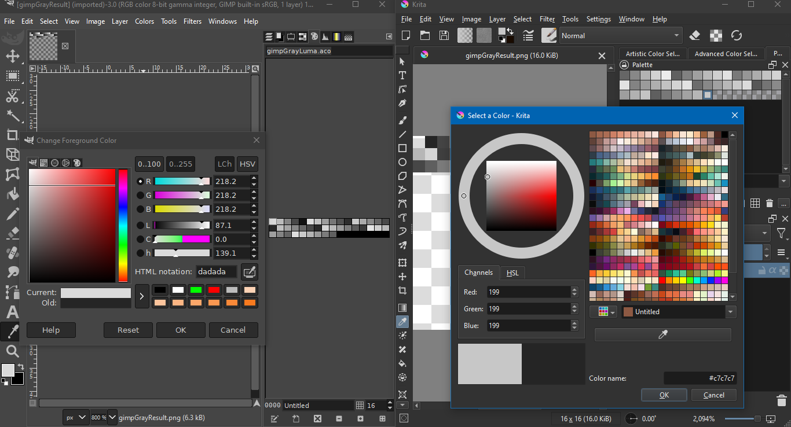

# Aseprite Swatch Exchange

This is an Adobe Swatch Exchange (`.ase`), Adobe Color (`.aco`) and Adobe Color Table (`.act`) import-export dialog for the [Aseprite](https://www.aseprite.org/) [scripting API](https://www.aseprite.org/docs/scripting/). Support for all formats is **partial**. The minimum supported version of Aseprite is 1.3.2 .

## File Extensions

### ACO Files

`.aco` files support palettes in RGB, HSB, CMYK, CIE LAB and Grayscale formats. Color channels are stored as 16-bit integers, i.e. in the ranges `[0, 65535]` for unsigned, `[-32768, 32767]` for signed.

`.aco` files from this script are tested against [Krita](https://krita.org/en/) and [GIMP](https://www.gimp.org/). GIMP doesn't seem to support the Lab format currently. Krita's conversion to and from 16-bit integers does not follow the `.aco` specification for the Lab format. On import this script clamps any out-of-gamut colors.

GIMP and Krita treat gray differently, with Krita seeming to interpret the gray in linear space.

There are two versions of `.aco`. Version 2 includes names per each swatch. Since Aseprite does not name palette swatches, this script reads and writes version 1 only. Version 2 is supposed to follow after 1, with the redundancy adding backwards compatibility. `.aco` files starting with the version 2 header may not be imported properly.

Rudimentary formulas for CMYK are included because they seemed better than throwing an unsupported exception. However, they should not be taken seriously and there are no plans to improve them.

### ASE Files

`.ase` files support palettes in RGB, CMYK, CIE LAB and Grayscale formats. HSB is not supported; the exporter will default to RGB for this case. Color values are stored as 32-bit floating point real numbers. CMYK should not be taken seriously.

`.ase` imports were tested initially with Krita. GIMP added support for `.ase` palettes as of version 2.10.36 on November 7, 2023. For the LAB format, Krita treats the lightness channel as being in the range [0.0, 1.0]; GIMP, in [0.0, 100.0]. For CMYK, GIMP expects RGB to be linear, not in gamma.

Swatches include names. This script writes the 6-digit hexadecimal code as name; it does not read the name on import.

These files may also include groups of colors. Groups are ignored by the importer. The distinction between global, spot and normal colors is ignored as well. The exporter writes a single group named "Palette" for all colors.

RGB format `.ase` palettes can be downloaded from [Lospec](https://lospec.com/palette-list).

### ACT Files

`.act` files support 8-bit RGB colors. These files come in two versions: 768 bytes and 772 bytes. The 768 byte version has no header or meta-data, it is just 256 colors (256 * 3 = 768). At the end of the 772 version are 2 bytes listing the number of colors and 2 bytes designating a transparent index. Neither Krita nor GIMP seem to support 772 bytes, so this script writes 768. It will try to read 772 bytes.

## Download

To download this script, click on the green Code button above, then select Download Zip. You can also click on the `aseSwatchIo.lua` file. Beware that some browsers will append a `.txt` file format extension to script files on download. Aseprite will not recognize the script until this is removed and the original `.lua` extension is used. There can also be issues with copying and pasting. Be sure to click on the Raw file button; do not copy the formatted code.

## Usage

To use this script, open Aseprite. In the menu bar, go to `File > Scripts > Open Scripts Folder`. Move the Lua script into the folder that opens. Return to Aseprite; go to `File > Scripts > Rescan Scripts Folder` (the default hotkey is `F5`). The script should now be listed under `File > Scripts`. Select `aseSwatchIo.lua` to launch the dialog.

If an error message in Aseprite's console appears, check if the script folder is on a file path that includes characters beyond ASCII, such as 'é' (e acute) or 'ö' (o umlaut).

A hot key can be assigned to the script by going to `Edit > Keyboard Shortcuts`. The search input box in the top left of the shortcuts dialog can be used to locate the script by its file name. The dialog can be closed with `Alt+C`. The import button can be activated with `Alt+I`; export, with `Alt+E`.

If a sprite is open, then the active sprite's palette is set to the import. If no sprite is open when a file is imported, the script will create a new sprite with the palette's swatches on the canvas; if the file is an Aseprite generated `.ase` file, then it will be opened as a sprite, not as a palette.

Open sprites in indexed color mode will be converted to RGB before the palette is set, then re-converted to indexed color mode after. This will reset its transparent color to zero.

### Color Profiles

Hexadecimal codes are not universal and transportable color identifiers. Such codes depend heavily on a color profile. Two colors may appear the same, but have different hex codes, or have the same code but appear differently. While newer palette file formats are color managed, older ones, like the `.gpl` and `.pal` formats used by Aseprite, are not.

Aseprite defaults to [standard RGB](https://en.wikipedia.org/wiki/SRGB), but Adobe software commonly uses Adobe RGB. If colors look slightly off when swapping between Aseprite and Adobe software, check the color profile by going to `Sprite > Properties`.

Aseprite allows the color profile to be set to `.icc` files via Lua script, but not through the UI. A dialog script to set the profile can be found at my other repository, [AsepriteAddons](https://github.com/behreajj/AsepriteAddons/blob/main/dialogs/color/setColorProfile.lua). The Adobe 1998 color profile can be downloaded from [here](https://www.adobe.com/digitalimag/adobergb.html) as an `.icc`.

To illustrate, above is a color wheel in sRGB. The pixel at 254, 128 is `#d92214`.

Here is the same color wheel with the Adobe RGB color profile assigned. The pixel has the same hex code, but appears different.

And here is a color wheel converted to Adobe RGB. The pixel appears the same, but has a different hex code, `#ba271b`.

## Debugging

This script was authored *without* access to Illustrator or Photoshop. Bugs are likely. Feel free to report in the [Issues](https://github.com/behreajj/AsepriteSwatchExchange/issues) section. If you do, please refer to the [issue template](./.github/ISSUE_TEMPLATE/file-a-bug-report.md).

If you would like to debug issues yourself, I recommend doing so in a hex editor. For example, the palette from the screen shot above looks like this as an `.aco`:

Row | 00 | 01 | 02 | 03 | 04 | 05 | 06 | 07 | 08 | 09 | 0A | 0B | 0C | 0D | 0E | 0F
---: | ---: | ---: | ---: | ---: | ---: | ---: | ---: | ---: | ---: | ---: | ---: | ---: | ---: | ---: | ---: | ---:
00000000|00|01|00|0E|00|00|00|00|00|00|00|00|00|00|00|00
00000010|FF|FF|FF|FF|FF|FF|00|00|00|00|DC|DC|3A|3A|3A|3A
00000020|00|00|00|00|F2|F2|7A|7A|2A|2A|00|00|00|00|FE|FE
00000030|AE|AE|14|14|00|00|00|00|FD|FD|DD|DD|19|19|00|00
00000040|00|00|CA|CA|DB|DB|1D|1D|00|00|00|00|86|86|C2|C2
00000050|3C|3C|00|00|00|00|03|03|9D|9D|69|69|00|00|00|00
00000060|00|00|8E|8E|96|96|00|00|00|00|00|00|73|73|9C|9C
00000070|00|00|00|00|02|02|5A|5A|9C|9C|00|00|00|00|62|62
00000080|31|31|79|79|00|00|00|00|99|99|1B|1B|58|58|00|00

The first two bytes `0x00 0x01` specify version 1. The next two `0x00 0x0E` specify the number of colors in the file, 14. A sequence of color blocks follow. The block's first two bytes `0x00 0x00` specify that RGB is the color format. The next eight bytes specify four channel values, with their meaning dependent on the format. Since white and black are the first colors, this is easier to see with the red, `0xDC 0xDC 0x3A 0x3A 0x3A 0x3A 0x00 0x00`.

Below is an `.ase` file containing the same colors, also in RGB format:

Row | 00 | 01 | 02 | 03 | 04 | 05 | 06 | 07 | 08 | 09 | 0A | 0B | 0C | 0D | 0E | 0F
---: | ---: | ---: | ---: | ---: | ---: | ---: | ---: | ---: | ---: | ---: | ---: | ---: | ---: | ---: | ---: | ---:
00000000|41|53|45|46|00|01|00|00|00|00|00|10|C0|01|00|00
00000010|00|12|00|08|00|50|00|61|00|6C|00|65|00|74|00|74
00000020|00|65|00|00|00|01|00|00|00|22|00|07|00|30|00|30
00000030|00|30|00|30|00|30|00|30|00|00|52|47|42|20|00|00
00000040|00|00|00|00|00|00|00|00|00|00|00|02|00|01|00|00
00000050|00|22|00|07|00|66|00|66|00|66|00|66|00|66|00|66
00000060|00|00|52|47|42|20|3F|80|00|00|3F|80|00|00|3F|80
00000070|00|00|00|02|00|01|00|00|00|22|00|07|00|64|00|63
00000080|00|33|00|61|00|33|00|61|00|00|52|47|42|20|3F|5C
00000090|DC|DD|3E|68|E8|E9|3E|68|E8|E9|00|02|00|01|00|00
000000A0|00|22|00|07|00|66|00|32|00|37|00|61|00|32|00|61
000000B0|00|00|52|47|42|20|3F|72|F2|F3|3E|F4|F4|F5|3E|28
000000C0|A8|A9|00|02|00|01|00|00|00|22|00|07|00|66|00|65
000000D0|00|61|00|65|00|31|00|34|00|00|52|47|42|20|3F|7E
000000E0|FE|FF|3F|2E|AE|AF|3D|A0|A0|A1|00|02|00|01|00|00
000000F0|00|22|00|07|00|66|00|64|00|64|00|64|00|31|00|39
00000100|00|00|52|47|42|20|3F|7D|FD|FE|3F|5D|DD|DE|3D|C8
00000110|C8|C9|00|02|00|01|00|00|00|22|00|07|00|63|00|61
00000120|00|64|00|62|00|31|00|64|00|00|52|47|42|20|3F|4A
00000130|CA|CB|3F|5B|DB|DC|3D|E8|E8|E9|00|02|00|01|00|00
00000140|00|22|00|07|00|38|00|36|00|63|00|32|00|33|00|63
00000150|00|00|52|47|42|20|3F|06|86|87|3F|42|C2|C3|3E|70
00000160|F0|F1|00|02|00|01|00|00|00|22|00|07|00|30|00|33
00000170|00|39|00|64|00|36|00|39|00|00|52|47|42|20|3C|40
00000180|C0|C1|3F|1D|9D|9E|3E|D2|D2|D3|00|02|00|01|00|00
00000190|00|22|00|07|00|30|00|30|00|38|00|65|00|39|00|36
000001A0|00|00|52|47|42|20|00|00|00|00|3F|0E|8E|8F|3F|16
000001B0|96|97|00|02|00|01|00|00|00|22|00|07|00|30|00|30
000001C0|00|37|00|33|00|39|00|63|00|00|52|47|42|20|00|00
000001D0|00|00|3E|E6|E6|E7|3F|1C|9C|9D|00|02|00|01|00|00
000001E0|00|22|00|07|00|30|00|32|00|35|00|61|00|39|00|63
000001F0|00|00|52|47|42|20|3C|00|80|81|3E|B4|B4|B5|3F|1C
00000200|9C|9D|00|02|00|01|00|00|00|22|00|07|00|36|00|32
00000210|00|33|00|31|00|37|00|39|00|00|52|47|42|20|3E|C4
00000220|C4|C5|3E|44|C4|C5|3E|F2|F2|F3|00|02|00|01|00|00
00000230|00|22|00|07|00|39|00|39|00|31|00|62|00|35|00|38
00000240|00|00|52|47|42|20|3F|19|99|9A|3D|D8|D8|D9|3E|B0
00000250|B0|B1|00|02|C0|02|00|00|00|00|  |  |  |  |  |  

The file begins with the header "ASEF" `0x41 0x53 0x45 0x46` followed by the file version 1.0.0 `0x00 0x01 0x00 0x00`. A block of color data begins with `0x00 x01`. The number of bytes that follow after in the block, 34, is signaled by `0x00 0x22`. The length of the swatch's name, 6, with a terminal zero appended, is given by `0x00 0x007`. After the name, `0x52 0x47 0x42 0x20` signals the "RGB " format. The number of color channels to follow depends on the format. This differs with `.aco`, which always had 4 channels. For RGB, there are 3 color channels with 4 bytes per channel. The bytes are converted to and from a 32-bit floating point real number. The color block concludes with the global, spot or normal color mode, `0x00 0x02`.

For more samples, see the samples folder of this repository.

## Modification

To modify these scripts, see Aseprite's [API Reference](https://github.com/aseprite/api). There is also a [type definition](https://github.com/behreajj/aseprite-type-definition) for use with VS Code and the [Lua Language Server extension](https://github.com/LuaLS/lua-language-server). I recommend a familiarity with Lua's `string.pack` and `string.unpack` methods. The formats for these methods can be found in Lua's [documentation](https://www.lua.org/manual/5.4/manual.html#6.4.2).

A useful introduction to the structure of these file formats can be found at "[Mastering Adobe Color File Formats](https://medium.com/swlh/mastering-adobe-color-file-formats-d29e43fde8eb)" by Marc Auberer. Richard Moss has a series of blog posts on [reading](https://devblog.cyotek.com/post/reading-photoshop-color-swatch-aco-files-using-csharp) and [writing](https://devblog.cyotek.com/post/writing-photoshop-color-swatch-aco-files-using-csharp) `.aco` files in C#, followed by [reading](https://devblog.cyotek.com/post/reading-adobe-swatch-exchange-ase-files-using-csharp) and [writing](https://devblog.cyotek.com/post/writing-adobe-swatch-exchange-ase-files-using-csharp) `.ase` files.

Formulae for converting between CIE LAB and standard or Adobe RGB can be found at [Easy RGB](https://www.easyrgb.com/en/math.php).